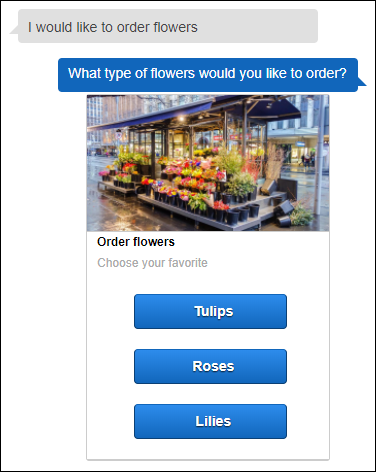
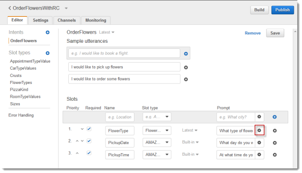
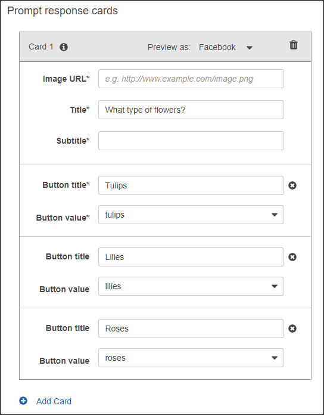

# Step 6 (Optional): Using a Response Card

In this section, you extend the step 1 by adding a response card. You create a bot that supports the OrderFlowers intent, and then update the intent by adding a response card for the `FlowerType` slot. In addition to the following prompt for the `FlowerType` slot, the user can choose the type of flowers from the response card:

```
What type of flowers would you like to order?
```

The following is the response card:



The bot user can either type the text or choose from the list of flower types. This response card is configured with an image, which appears in the client as shown.

To create and test a bot with a response card:

1. Follow the step 1 to create and test an OrderFlowers bot. You must complete steps 1, 2, and 3. You don't need to add a Lambda function to test the response card. For instructions, see [Step 1: Create an Amazon Lex Bot](ex1-step1.md).

1. Update the bot by adding the response card, and then publish a version. When you publish a version, specify an alias (BETA) to point to it. 

   1. In the Amazon Lex console, choose your bot.

   1. Choose the `OrderFlowers` intent. 

   1. Choose the settings gear icon next to the "What type of flowers" **Prompt** to configure a response card for the `FlowerType`.  


   1. Give the card a title and configure three buttons as shown in the following screen shot. You can optionally add an image to the response card, provided you have an image URL. If you are deploying your bot using Twilio SMS, you must provide an image URL.  


   1. Choose **Save** to save the response card.

   1. Choose **Save intent** to save the intent configuration.

   1. To build the bot, choose **Build**.

   1. To publish a bot version, choose **Publish**. Specify BETA as an alias that points to the bot version.
   
**Next Step**  
[Step 7 (Optional): Clean Up](ex1-step7.md)
