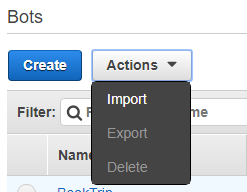
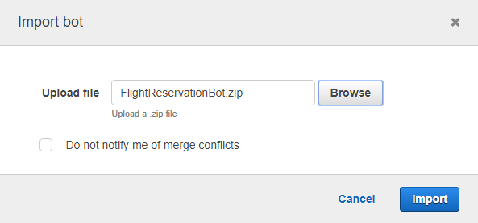
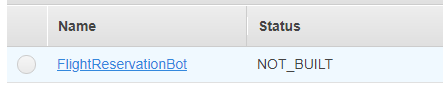

# Step 5 (Optional): Capturing and Validating Alphanumeric Identifiers

In this section, you can use `AMAZON.AlphaNumeric` slot type in Amazon Lex to capture such inputs in your bot. This slot type can capture combinations of letters and numbers. You can extend this slot type by applying a validation check to create a custom slot type. You can apply these validation checks by specifying a regular expression (regex) on the `AMAZON.AlphaNumeric` slot type. This post demonstrates how to use the `AMAZON.AlphaNumeric` slot type to capture alphanumeric information and restrict such input to a specific pattern.

## Create New Slot Type

You can create the built-in slot type `AMAZON.AlphaNumeric`. Such a design helps capture alphanumeric information but doesn’t validate it. To validate, use a regular expression. Create a new slot type FlightNo by extending `AMAZON.AlphaNumeric`. The flight number has a fixed format of six characters: [letter] [letter][number][number][number][number]. For example, HK2020 is a flight number.

1. In the Amazon Lex console, choose the **BookTrip** bot.

1. On the **Editor** tab, next to **Slot types**, choose the plus sign.

1. Choose **Extend slot type**.


1. For **Slot type name**, enter `FlightNo`.

1. For **Description**, enter a description (`Flight Number`) of your slot type.

1. For **Regular expression**, restrict the slot type to the six-character fixed format as specified previously by entering the expression `[a-zA-Z]{2}[0-9]{4}`.

1. Choose **Save slot type**.  


## Add New Slot Type to Your Bot
You can now use the `FlightNo` slot type to design the `BookHotel` intent for your bot and make sure that the user input contains a valid flight number.

To add the `FlightNo` slot type to the `BookHotel` intent, complete the following steps:

1. In the Amazon Lex console, choose the **BookTrip** bot. 
1. On the **Editor** tab, under **Intents**, choose **BookHotel**.
1. Under **Slots**, add a new slot `ArrivalFlightNo` with Slot type `FlightNo` with an appropriate prompt (`Please provide us your arrival flight number for free airport delivery`).
1. Design the rest of the bot as per your use-case.
1. Choose **Save Intent**, **Build**, and **Publish**.

Your bot is now ready to use. You can test it by providing a flight number such as ABCDE that does not match the pattern specified by the regular expression. For more information please refer to the [Built-in Slot Types](https://docs.aws.amazon.com/lex/latest/dg/howitworks-builtins-slots.html). 

## Import Bot
We have prepared the scenario and model a bot uses the following conversation to :
```
User: I want to reschedule my flight.
Agent: Sure. Can you provide the confirmation code?
User: ABC12D
Agent: Thank you. I see you are on the 6 AM flight to Seattle tomorrow. What would you like to change to?
User: I want to change to next Monday.
Agent: What time would you prefer to travel?
User: 8 AM.
Agent: Sure. Let me make that change. For authentication purposes, can I get the last four digits of the credit card number?
User: 1234.
Agent: Excellent. I have rescheduled you for the flight departing on February 10 at 8 AM. Anything else I can help you with?
User: No.
Agent: Thank you. Have a great day!
```

You can follow below steps to import the bot to your Amazon Lex for further development.

1. Download the bot ([`FlightReservationBot`](../source/FlightReservationBot.zip)) with the following intents:
   + MakeReservation – Elicits the travel date, source, and destination cities to process a reservation and return a booking confirmation code.
   + ModifyReservation – Elicits the confirmation code and last four digits of the user’s credit card number to modify the reservation.
   + CancelReservation – Elicits the confirmation code to cancel the reservation.

1. In the Amazon Lex console, choose **Actions**, then **Import**.  


1. Choose **Browse** and select downloaded zip file, choose **Import**.  


1. Choose `FlightReservationBot` with status `NOT-BUILT`.  


1. Choose **Build** and test the bot.
