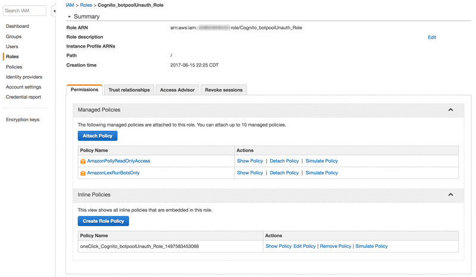

# Exercise 4: Integrate Your Amazon Lex Bot with Static Web Page

You have built and tested your bots in previous exercises. It is time for you to push this out to a static website, but you want to ensure it・s not left wide open. You know Amazon Cognito will let you manage permissions and users for mobile and web apps, so you start with an Amazon Cognito federated identity pool.

**Set up Amazon Cognito**

1. From the Amazon Cognito console, you choose **Manage identity pool**, and then choose **Create new identity pool**.

1. You provide a pool name (botpool), choose Enable access to unauthenticated identities, and then choose **Create Pool**:


1. To create the pool and the associated AWS Identity and Access Management (IAM) roles, you choose **Allow**. Then, you record the IAM role names so you can modify them:


1. Finally, you get the pool ID that you need for the JavaScript you will use to integrate the bot.


1. You modify the IAM roles to allow access to Amazon Lex. From the IAM console, you find the roles and change each of them to attach the AmazonLexRunBotsOnly and AmazonPollyReadOnlyAccess policies:


**Test your chatbot on the web**
You quickly put together an [HTML file](../source/aws-lex-template.html) that you can use to test your bot. The pool ID is used here to establish an IAM session.

```
<!DOCTYPE html>
<html>

<head>
  <title>Amazon Lex for JavaScript - Sample Application</title>
  <script src="https://sdk.amazonaws.com/js/aws-sdk-2.149.0.min.js"></script>
  <style language="text/css">
    input#wisdom {
      padding: 4px;
      font-size: 1em;
      width: 400px
    }

    input::placeholder {
      color: #ccc;
      font-style: italic;
    }

    p.userRequest {
      margin: 4px;
      padding: 4px 10px 4px 10px;
      border-radius: 4px;
      min-width: 50%;
      max-width: 85%;
      float: left;
      background-color: #7d7;
    }

    p.lexResponse {
      margin: 4px;
      padding: 4px 10px 4px 10px;
      border-radius: 4px;
      text-align: right;
      min-width: 50%;
      max-width: 85%;
      float: right;
      background-color: #bbf;
      font-style: italic;
    }

    p.lexError {
      margin: 4px;
      padding: 4px 10px 4px 10px;
      border-radius: 4px;
      text-align: right;
      min-width: 50%;
      max-width: 85%;
      float: right;
      background-color: #f77;
    }
  </style>
</head>

<body>
  <h1 style="text-align:  left">Amazon Lex - Chatbot Test</h1>
  <p style="width: 400px">
    This little chatbot shows how easy it is to incorporate
    <a href="https://aws.amazon.com/lex/" title="Amazon Lex (product)" target="_new">Amazon Lex</a> into your web pages.  Try it out.
  </p>
  <div id="conversation" style="width: 400px; height: 400px; border: 1px solid #ccc; background-color: #eee; padding: 4px; overflow: scroll"></div>
  <form id="chatform" style="margin-top: 10px" onsubmit="return pushChat();">
    <input type="text" id="wisdom" size="80" value="" placeholder="I need a hotel room">
  </form>
  <script type="text/javascript">
    // set the focus to the input box
    document.getElementById("wisdom").focus();

    // Initialize the Amazon Cognito credentials provider
    AWS.config.region = 'ap-southeast-2'; // Region
    AWS.config.credentials = new AWS.CognitoIdentityCredentials({
    // Provide your Pool Id here
      IdentityPoolId: 'us-east-1:XXXXX',
    });

    var lexruntime = new AWS.LexRuntime();
    var lexUserId = 'chatbot-demo' + Date.now();
    var sessionAttributes = {};

    function pushChat() {

      // if there is text to be sent...
      var wisdomText = document.getElementById('wisdom');
      if (wisdomText && wisdomText.value && wisdomText.value.trim().length > 0) {

        // disable input to show we're sending it
        var wisdom = wisdomText.value.trim();
        wisdomText.value = '...';
        wisdomText.locked = true;

        // send it to the Lex runtime
        var params = {
          botAlias: '$LATEST',
          botName: 'BookTrip',
          inputText: wisdom,
          userId: lexUserId,
          sessionAttributes: sessionAttributes
        };
        showRequest(wisdom);
        lexruntime.postText(params, function(err, data) {
          if (err) {
            console.log(err, err.stack);
            showError('Error:  ' + err.message + ' (see console for details)')
          }
          if (data) {
            // capture the sessionAttributes for the next cycle
            sessionAttributes = data.sessionAttributes;
            // show response and/or error/dialog status
            showResponse(data);
          }
          // re-enable input
          wisdomText.value = '';
          wisdomText.locked = false;
        });
      }
      // we always cancel form submission
      return false;
    }

    function showRequest(daText) {

      var conversationDiv = document.getElementById('conversation');
      var requestPara = document.createElement("P");
      requestPara.className = 'userRequest';
      requestPara.appendChild(document.createTextNode(daText));
      conversationDiv.appendChild(requestPara);
      conversationDiv.scrollTop = conversationDiv.scrollHeight;
    }

    function showError(daText) {

      var conversationDiv = document.getElementById('conversation');
      var errorPara = document.createElement("P");
      errorPara.className = 'lexError';
      errorPara.appendChild(document.createTextNode(daText));
      conversationDiv.appendChild(errorPara);
      conversationDiv.scrollTop = conversationDiv.scrollHeight;
    }

    function showResponse(lexResponse) {

      var conversationDiv = document.getElementById('conversation');
      var responsePara = document.createElement("P");
      responsePara.className = 'lexResponse';
      if (lexResponse.message) {
        responsePara.appendChild(document.createTextNode(lexResponse.message));
        responsePara.appendChild(document.createElement('br'));
      }
      if (lexResponse.dialogState === 'ReadyForFulfillment') {
        responsePara.appendChild(document.createTextNode(
          'Ready for fulfillment'));
        // TODO:  show slot values
      } else {
        responsePara.appendChild(document.createTextNode(
          '(' + lexResponse.dialogState + ')'));
      }
      conversationDiv.appendChild(responsePara);
      conversationDiv.scrollTop = conversationDiv.scrollHeight;
    }
  </script>
</body>

</html>
```

You upload the file so that you can host it on Amazon S3 as a static web site to test your chatbot on the web.


Now that・s a productive morning! You send a quick note to the team and head out for a well-deserved break.

**Monitoring and feedback**
By the time you get back, a few people have already tried out the bot. You check the Amazon Lex console for metrics.

You notice that some people have been saying, ：hotel for 2 nights； and Amazon Lex isn・t catching that, so you add a new utterance and rebuild the bot: You realize that you can use the Model API to do this programmatically, but this will do for now. You・ve met your goal and can now demo your solution.

**Conclusion**
Amazon Lex makes it easy to create functioning bots in minutes. Using services like Amazon Cognito and Amazon S3, you can quickly integrate a chatbot into a web experience, but there is so much more to do. How can you tell when there are a hundred users of the new bot? Could you wire it up to the web analytics? Could you fire analytics events when the visitor gets to a certain step in the interaction?