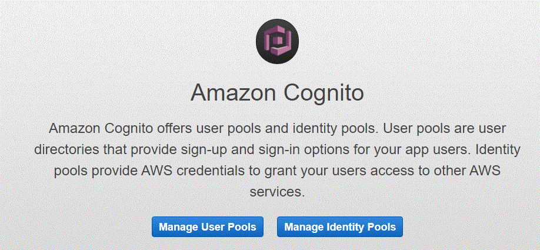
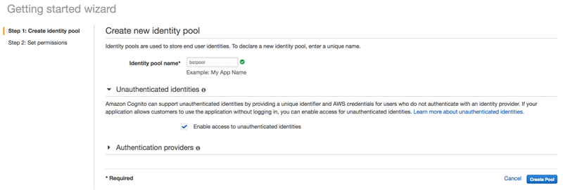
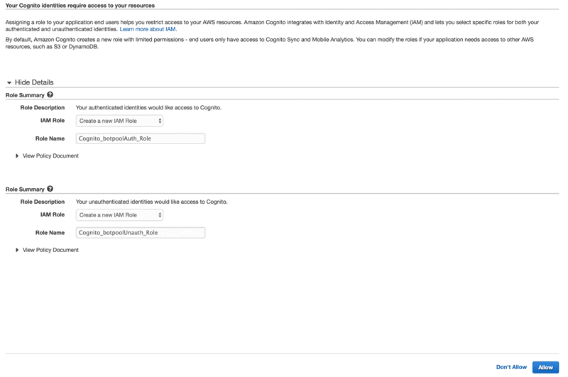
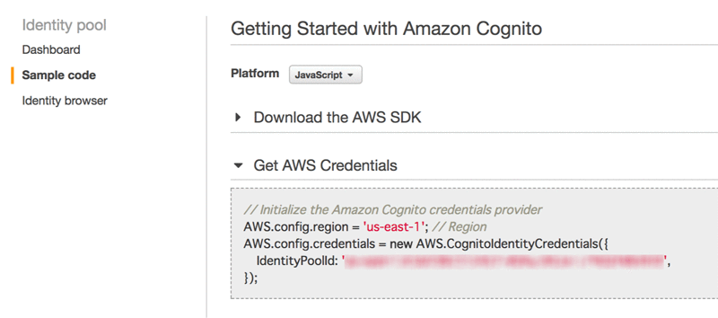
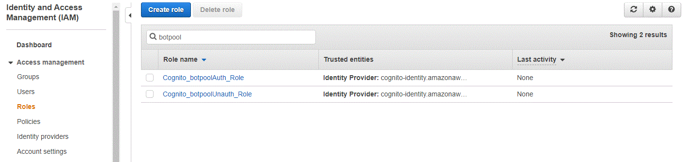
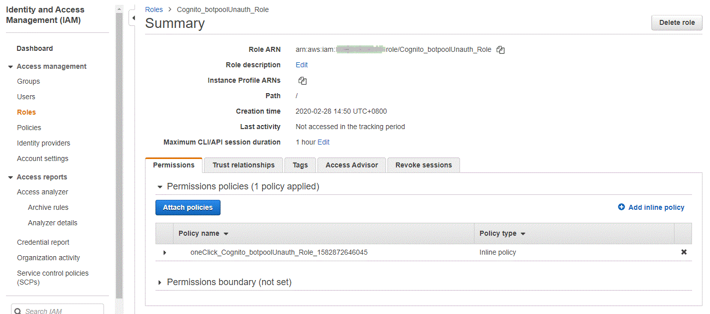
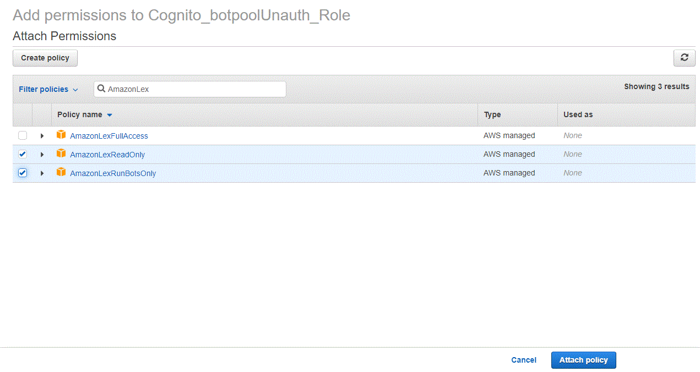
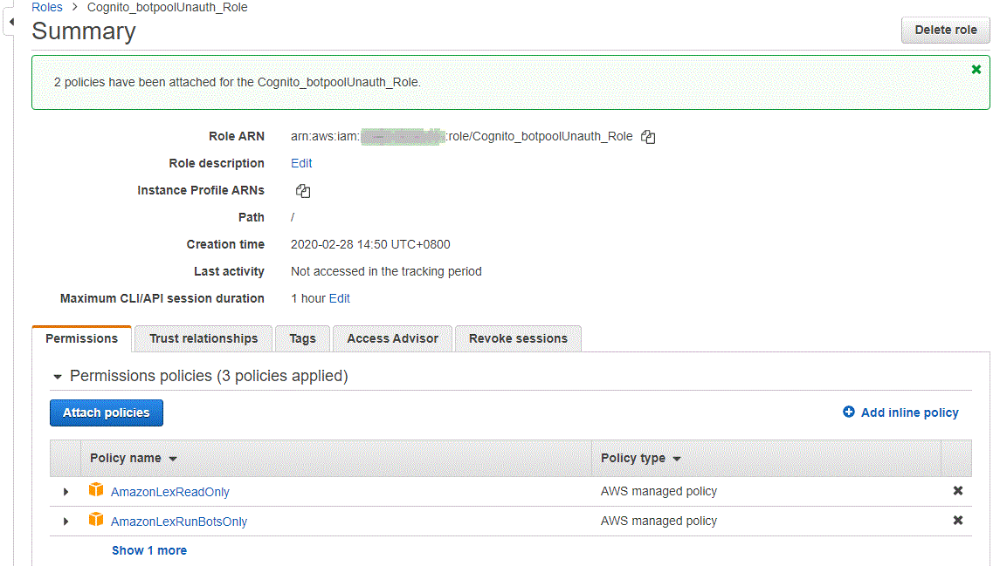
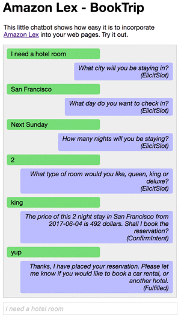

# Exercise 4: Integrate Your Amazon Lex Bot with Static Web Page

You have built and tested your bots in the previous exercises. It is time for you to push this out to a static website, but you want to ensure it's not left wide open. You know Amazon Cognito will let you manage permissions and users for mobile and web apps, so you start with an Amazon Cognito federated identity pool.

**Set up Amazon Cognito**
1. Sign in to the AWS Management Console and open the AWS Cognito console at [https://console.aws.amazon.com/cognito/](https://console.aws.amazon.com/cognito/).

1. Choose **Manage Identity Pool** for your first setup; otherwise, on the **Federated Identities** page, choose **Create new identity pool**.


1. Provide identity pool name (`botpool`), choose **Enable access to unauthenticated identities**, and then choose **Create Pool**:


1. Create the pool and the associated AWS Identity and Access Management (IAM) roles, you choose **Allow**. Then, you record the IAM role names so you can modify them:


1. On the **Sample code** page, choose **JavaScript** in platform, you get the **AWS Credentials** that you need for integrating the bot.


1. Modify the IAM roles to allow access to Amazon Lex, open the AWS IAM console at [https://console.aws.amazon.com/iam/](https://console.aws.amazon.com/iam/).

1. Choose **Roles** under **Access Management**, search `botpool` to list the roles created before.


1. Choose **Cognito_botpoolUnauth_Role**, choose **Attach policies**.


1. Search **AmazonLex** under **Filter policies**, choose **AmazonLexReadOnly** and **AmazonLexRunBotsOnly**, and choose **Attach policy**.


1. Access right granted for **Cognito_botpoolUnauth_Role**; repeat above steps to grant access for **Cognito_botpoolAuth_Role**.



**Test your chatbot on the web**  
Download the [HTML file for BookTrip](../source/aws-lex-template.html) and run it in your browser. Change the values of `region`, `IdentityPoolId`, `botName` and placeholder of `wisdom` if you want to test your bots.

```
<!DOCTYPE html>
<html>

<head>
  <title>Amazon Lex for JavaScript - BookTrip</title>
  <script src="https://sdk.amazonaws.com/js/aws-sdk-2.149.0.min.js"></script>
  <style language="text/css">
    input#wisdom {
      padding: 4px;
      font-size: 1em;
      width: 400px
    }

    input::placeholder {
      color: #ccc;
      font-style: italic;
    }

    p.userRequest {
      margin: 4px;
      padding: 4px 10px 4px 10px;
      border-radius: 4px;
      min-width: 50%;
      max-width: 85%;
      float: left;
      background-color: #7d7;
    }

    p.lexResponse {
      margin: 4px;
      padding: 4px 10px 4px 10px;
      border-radius: 4px;
      text-align: right;
      min-width: 50%;
      max-width: 85%;
      float: right;
      background-color: #bbf;
      font-style: italic;
    }

    p.lexError {
      margin: 4px;
      padding: 4px 10px 4px 10px;
      border-radius: 4px;
      text-align: right;
      min-width: 50%;
      max-width: 85%;
      float: right;
      background-color: #f77;
    }
  </style>
</head>

<body>
  <h1 style="text-align:  left">Amazon Lex - BookTrip</h1>
  <p style="width: 400px">
    This little chatbot shows how easy it is to incorporate
    <a href="https://aws.amazon.com/lex/" title="Amazon Lex (product)" target="_new">Amazon Lex</a> into your web pages.  Try it out.
  </p>
  <div id="conversation" style="width: 400px; height: 400px; border: 1px solid #ccc; background-color: #eee; padding: 4px; overflow: scroll"></div>
  <form id="chatform" style="margin-top: 10px" onsubmit="return pushChat();">
    // Sample utterance in placeholder
    <input type="text" id="wisdom" size="80" value="" placeholder="I need a hotel room">
  </form>
  <script type="text/javascript">
    // set the focus to the input box
    document.getElementById("wisdom").focus();

    // Initialize the Amazon Cognito credentials provider
    AWS.config.region = 'ap-southeast-2'; // Region
    AWS.config.credentials = new AWS.CognitoIdentityCredentials({
    // Provide your Pool Id here
      IdentityPoolId: 'ap-southeast-2:XXXXXXXXXXXXXXXXXXXXXXXXXXXXX',
    });

    var lexruntime = new AWS.LexRuntime();
    var lexUserId = 'chatbot-demo' + Date.now();
    var sessionAttributes = {};

    function pushChat() {

      // if there is text to be sent...
      var wisdomText = document.getElementById('wisdom');
      if (wisdomText && wisdomText.value && wisdomText.value.trim().length > 0) {

        // disable input to show we're sending it
        var wisdom = wisdomText.value.trim();
        wisdomText.value = '...';
        wisdomText.locked = true;

        // send it to the Lex runtime
        var params = {
          botAlias: '$LATEST',
          botName: 'BookTrip',
          inputText: wisdom,
          userId: lexUserId,
          sessionAttributes: sessionAttributes
        };
        showRequest(wisdom);
        lexruntime.postText(params, function(err, data) {
          if (err) {
            console.log(err, err.stack);
            showError('Error:  ' + err.message + ' (see console for details)')
          }
          if (data) {
            // capture the sessionAttributes for the next cycle
            sessionAttributes = data.sessionAttributes;
            // show response and/or error/dialog status
            showResponse(data);
          }
          // re-enable input
          wisdomText.value = '';
          wisdomText.locked = false;
        });
      }
      // we always cancel form submission
      return false;
    }

    function showRequest(daText) {

      var conversationDiv = document.getElementById('conversation');
      var requestPara = document.createElement("P");
      requestPara.className = 'userRequest';
      requestPara.appendChild(document.createTextNode(daText));
      conversationDiv.appendChild(requestPara);
      conversationDiv.scrollTop = conversationDiv.scrollHeight;
    }

    function showError(daText) {

      var conversationDiv = document.getElementById('conversation');
      var errorPara = document.createElement("P");
      errorPara.className = 'lexError';
      errorPara.appendChild(document.createTextNode(daText));
      conversationDiv.appendChild(errorPara);
      conversationDiv.scrollTop = conversationDiv.scrollHeight;
    }

    function showResponse(lexResponse) {

      var conversationDiv = document.getElementById('conversation');
      var responsePara = document.createElement("P");
      responsePara.className = 'lexResponse';
      if (lexResponse.message) {
        responsePara.appendChild(document.createTextNode(lexResponse.message));
        responsePara.appendChild(document.createElement('br'));
      }
      if (lexResponse.dialogState === 'ReadyForFulfillment') {
        responsePara.appendChild(document.createTextNode(
          'Ready for fulfillment'));
        // TODO:  show slot values
      } else {
        responsePara.appendChild(document.createTextNode(
          '(' + lexResponse.dialogState + ')'));
      }
      conversationDiv.appendChild(responsePara);
      conversationDiv.scrollTop = conversationDiv.scrollHeight;
    }
  </script>
</body>

</html>
```

You can upload and host the HTML file on your web server as a static web site to test your chatbot in the public.

