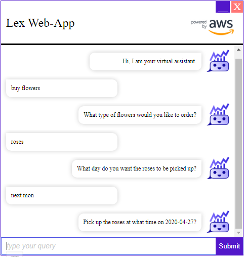

# Exercise 4: Integrate Your Amazon Lex Bot On The Web

You have built and tested your bots in the previous exercises. It is time for you to push this out to a static website, but you want to ensure it's not left wide open. You know Amazon Cognito will let you manage permissions and users for mobile and web apps, so you start with an Amazon Cognito federated identity pool.

**Set up Amazon Cognito**
1. Sign in to the AWS Management Console and open the AWS Cognito console at [https://console.aws.amazon.com/cognito/](https://console.aws.amazon.com/cognito/).

1. Choose **Manage Identity Pool** for your first setup; otherwise, on the **Federated Identities** page, choose **Create new identity pool**.


1. Provide identity pool name (`botpool`), choose **Enable access to unauthenticated identities**, and then choose **Create Pool**:


1. Create the pool and the associated AWS Identity and Access Management (IAM) roles, you choose **Allow**. Then, you record the IAM role names so you can modify them:


1. On the **Sample code** page, choose `JavaScript` in **Platform**, you get the **AWS Credentials** that you need for integrating the bot.


1. Modify the IAM roles to allow access to Amazon Lex, open the AWS IAM console at [https://console.aws.amazon.com/iam/](https://console.aws.amazon.com/iam/).

1. Choose **Roles** under **Access Management**, search `botpool` to list the roles created before.


1. Choose **Cognito_botpoolUnauth_Role**, choose **Attach policies**.


1. Type **AmazonLex** in **Filter policies**, choose **AmazonLexReadOnly** and **AmazonLexRunBotsOnly**, and choose **Attach policy**.


1. Access right granted for **Cognito_botpoolUnauth_Role**; repeat above steps to grant access for **Cognito_botpoolAuth_Role**.
  


**Test your Chatbot by Static HTML Page**  
  - Download the [HTML file for BookTrip](../source/aws-lex-template.html) and run it in your browser.
  - Change the values of `region`, `IdentityPoolId`, `botName` and placeholder of `wisdom`

  ```
  <!DOCTYPE html>
  <html>
  
  <head>
    <title>Amazon Lex for JavaScript - BookTrip</title>
    <script src="https://sdk.amazonaws.com/js/aws-sdk-2.661.0.min.js"></script>
    <style language="text/css">
      input#wisdom {
        padding: 4px;
        font-size: 1em;
        width: 400px
      }
  
      input::placeholder {
        color: #ccc;
        font-style: italic;
      }
  
      p.userRequest {
        margin: 4px;
        padding: 4px 10px 4px 10px;
        border-radius: 4px;
        min-width: 50%;
        max-width: 85%;
        float: left;
        background-color: #7d7;
      }
  
      p.lexResponse {
        margin: 4px;
        padding: 4px 10px 4px 10px;
        border-radius: 4px;
        text-align: right;
        min-width: 50%;
        max-width: 85%;
        float: right;
        background-color: #bbf;
        font-style: italic;
      }
  
      p.lexError {
        margin: 4px;
        padding: 4px 10px 4px 10px;
        border-radius: 4px;
        text-align: right;
        min-width: 50%;
        max-width: 85%;
        float: right;
        background-color: #f77;
      }
    </style>
  </head>
  
  <body>
    <h1 style="text-align:  left">Amazon Lex - BookTrip</h1>
    <p style="width: 400px">
      This little chatbot shows how easy it is to incorporate
      <a href="https://aws.amazon.com/lex/" title="Amazon Lex (product)" target="_new">Amazon Lex</a> into your web pages.  Try it out.
    </p>
    <div id="conversation" style="width: 400px; height: 400px; border: 1px solid #ccc; background-color: #eee; padding: 4px; overflow: scroll"></div>
    <form id="chatform" style="margin-top: 10px" onsubmit="return pushChat();">
      // Sample utterance in placeholder
      <input type="text" id="wisdom" size="80" value="" placeholder="I need a hotel room">
    </form>
    <script type="text/javascript">
      // set the focus to the input box
      document.getElementById("wisdom").focus();
  
      // Initialize the Amazon Cognito credentials provider
      AWS.config.region = 'ap-southeast-2'; // Region
      AWS.config.credentials = new AWS.CognitoIdentityCredentials({
      // Provide your Pool Id here
        IdentityPoolId: 'ap-southeast-2:XXXXXXXXXXXXXXXXXXXXXXXXXXXXX',
      });
  
      var lexruntime = new AWS.LexRuntime();
      var lexUserId = 'chatbot-demo' + Date.now();
      var sessionAttributes = {};
  
      function pushChat() {
  
        // if there is text to be sent...
        var wisdomText = document.getElementById('wisdom');
        if (wisdomText && wisdomText.value && wisdomText.value.trim().length > 0) {
  
          // disable input to show we're sending it
          var wisdom = wisdomText.value.trim();
          wisdomText.value = '...';
          wisdomText.locked = true;
  
          // send it to the Lex runtime
          var params = {
            botAlias: '$LATEST',
            botName: 'BookTrip',
            inputText: wisdom,
            userId: lexUserId,
            sessionAttributes: sessionAttributes
          };
          showRequest(wisdom);
          lexruntime.postText(params, function(err, data) {
            if (err) {
              console.log(err, err.stack);
              showError('Error:  ' + err.message + ' (see console for details)')
            }
            if (data) {
              // capture the sessionAttributes for the next cycle
              sessionAttributes = data.sessionAttributes;
              // show response and/or error/dialog status
              showResponse(data);
            }
            // re-enable input
            wisdomText.value = '';
            wisdomText.locked = false;
          });
        }
        // we always cancel form submission
        return false;
      }
  
      function showRequest(daText) {
  
        var conversationDiv = document.getElementById('conversation');
        var requestPara = document.createElement("P");
        requestPara.className = 'userRequest';
        requestPara.appendChild(document.createTextNode(daText));
        conversationDiv.appendChild(requestPara);
        conversationDiv.scrollTop = conversationDiv.scrollHeight;
      }
  
      function showError(daText) {
  
        var conversationDiv = document.getElementById('conversation');
        var errorPara = document.createElement("P");
        errorPara.className = 'lexError';
        errorPara.appendChild(document.createTextNode(daText));
        conversationDiv.appendChild(errorPara);
        conversationDiv.scrollTop = conversationDiv.scrollHeight;
      }
  
      function showResponse(lexResponse) {
  
        var conversationDiv = document.getElementById('conversation');
        var responsePara = document.createElement("P");
        responsePara.className = 'lexResponse';
        if (lexResponse.message) {
          responsePara.appendChild(document.createTextNode(lexResponse.message));
          responsePara.appendChild(document.createElement('br'));
        }
        if (lexResponse.dialogState === 'ReadyForFulfillment') {
          responsePara.appendChild(document.createTextNode(
            'Ready for fulfillment'));
          // TODO:  show slot values
        } else {
          responsePara.appendChild(document.createTextNode(
            '(' + lexResponse.dialogState + ')'));
        }
        conversationDiv.appendChild(responsePara);
        conversationDiv.scrollTop = conversationDiv.scrollHeight;
      }
    </script>
  </body>
  
  </html>
  ```

You can upload and host the [Static HTML Page](../source/aws-lex-template.html) on your web server to test your chatbot in the public. This page supports the **Plain Text** bot only. You can embed your own UI and UX design to the static page for decoration.  
  


**Test your Chatbot by Webapp**
  - Copy [`aws-lex-bot-wizard`](../source/aws-lex-bot-wizard) folder to project.
  - Just add following [markup](../source/aws-lex-bot-wizard/widget.html) to any page or add new html file with this content:
  ```
  <script>
    fullPage = false;
    chatbot_identifier = 'chatbot-widget';
    botName = '<lex-bot>'
    awsRegion = '<aws-region>'
    awsCognitoPoolId = '<aws-cognito-pool>'
  </script>
  <div id="chatbot-widget" data-username="Hey User">
  <script src="bundle.min.js"></script>
  ```
  Change the `botName`, `awsRegion`, `awsCognitoPoolId` and bundle file path.
  
  [Full Page HTML](../source/aws-lex-bot-wizard/full-page.html) with `OrderFlowers` Bot for your reference.

  This webapp supports the **Response Card** feature.
  


  
**Test your Chatbot by Web UI Component**  
Directly loading the chatbot UI component works at a lower level than using the loader library as described above. This approach can be used if you want to manually control the rendering, configuration and dependency loading process.

The entry point to the chatbot UI component is the `lex-web-ui.js` JavaScript file. The UI CSS styles are contained in the `lex-web-ui.css` file. The component depends on the [Vue](https://vuejs.org), [Vuex](https://vuex.vuejs.org), [Vuetify](https://vuetifyjs.com) and [AWS SDK](https://aws.amazon.com/sdk-for-browser) libraries. You should either host these dependencies on your site or load them from a third-party CDN.

The HTML code below is an illustration of directly loading the chatbot UI library and its dependencies.

**NOTE**: The versions of the links below may need to be pointed to the latest supported versions.

  - Copy [`aws-lex-web-ui`](../source/aws-lex-web-ui) folder to project.
  - Just add following [markup](../source/aws-lex-web-ui/template.html) to any page or add new html file with this content:
  ```
  <html>
    <head>
      <!-- Font Dependencies -->
      <link href="https://fonts.googleapis.com/css?family=Roboto:300,400,500,700|Material+Icons" rel="stylesheet" type="text/css">

      <!-- Vuetify CSS Dependencies -->
      <link href="https://unpkg.com/vuetify@0.16.9/dist/vuetify.min.css" rel="stylesheet" type="text/css">

      <!-- LexWebUi CSS from dist directory -->
      <link href="./lex-web-ui.css" rel="stylesheet" type="text/css">
      <!-- page specific LexWebUi styling -->
      <style type="text/css">
        #lex-web-ui-app { display: flex; height: 100%; width: 100%; }
        body, html { overflow-y: auto; overflow-x: hidden; }
      </style>
    </head>
    <body>
      <!-- application will be dynamically mounted here -->
      <div id="lex-web-ui"></div>

      <!--
        Vue, Vuex, Vuetifiy and AWS SDK dependencies must be loaded before lex-web-ui.js.
        Loading from third party CDN for quick testing
      -->
      <script src="https://unpkg.com/vue@2.5.3"></script>
      <script src="https://unpkg.com/vuex@3.0.1"></script>
      <script src="https://unpkg.com/vuetify@0.16.9"></script>    
      <script src="https://sdk.amazonaws.com/js/aws-sdk-2.661.0.min.js"></script>

      <!-- LexWebUi Library from dist directory -->
      <script src="./lex-web-ui.js"></script>

      <!-- instantiate the web ui with a basic config -->
      <script>
        // LexWebUi supports numerous configuration options. Here
        // is an example using just a couple of the required options.
        var config = {
          region: 'ap-southeast-2',
          cognito: {
            // Your Cognito Pool Id - this is required to provide AWS credentials
            poolId: 'ap-southeast-2:XXXXXXXXXXXXXXXXXXXXXXXXXXXXX'
          },
          lex: {
            // Lex Bot Name in your account
            botName: 'OrderFlowers',
            initialText: ''  //Initial Message
          },
          recorder: {
            enable: true
          }          
        };
        console.log(config);
        // load the LexWebUi component
        var lexWebUi = new LexWebUi.Loader(config);
        // instantiate Vue
        new Vue({
          el: '#lex-web-ui',
          store: lexWebUi.store,
          template: '<div id="lex-web-ui-app"><lex-web-ui/></div>',
        });
      </script>
    </body>
  </html>
  ```
  Change the `botName`, `region`, `poolId`, JavaScript and CSS file path.
  

  
  For more information, please refer to [Sample Amazon Lex Web Interface](https://github.com/aws-samples/aws-lex-web-ui).
