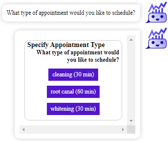
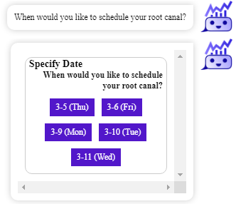
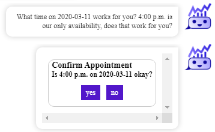

# Exercise 5: Create a Bot with Dynamic Response Card

The example bot in this exercise schedules appointments for a dentist's office. The example also illustrates using response cards to obtain user input with buttons. Specifically, the example illustrates generating response cards dynamically at runtime.

You can configure response cards at build time (also referred to as static response cards) or generate them dynamically in an AWS Lambda function. In this example, the bot uses the following response cards:
+ A response card that lists buttons for appointment type. For example:  

+ A response card that lists buttons for appointment date. For example:  

+ A response card that lists buttons to confirm a suggested appointment time. For example:  

The available appointment dates and times vary, which requires you to generate response cards at runtime. You use an AWS Lambda function to generate these response cards dynamically. The Lambda function returns response cards in its response to Amazon Lex. Amazon Lex includes the response card in its response to the client. 

If a client (for example, Facebook Messenger) supports response cards, the user can either choose from the list of buttons or type the response. Otherwise, the user simply types the response.

In addition to the button shown in the preceding example, you can also include images, attachments, and other useful information to display on response cards. For information about response cards, see [Response Cards](https://docs.aws.amazon.com/lex/latest/dg/howitworks-manage-prompts.html#msg-prompts-resp-card).

In this exercise, you do the following:
+ Create and test a bot (using the ScheduleAppointment blueprint). For this exercise, you use a bot blueprint to quickly set up and test the bot.

+ Create and test a Lambda function (using the lex-make-appointment-python blueprint provided by Lambda). You configure the `MakeAppointment` intent to use this Lambda function as a code hook to perform initialization, validation, and fulfillment tasks.

**Note**  
The provided example Lambda function showcases a dynamic conversation based on the mocked-up availability of a dentist appointment. In a real application, you might use a real calendar to set an appointment.

+ Update the `MakeAppointment` intent configuration to use the Lambda function as a code hook. Then, test the end-to-end experience. 
+ Publish the schedule appointment bot to Chatbot Webapp so you can see the response cards in action.

The following sections provide summary information about the blueprints you use in this exercise.

**Topics**
+ [Overview of the Bot Blueprint (ScheduleAppointment)](#sch-appt-bp-summary-bot)
+ [Overview of the Lambda Function Blueprint (lex-make-appointment-python)](#sch-appt-summary-lambda)
+ [Step 1: Create an Amazon Lex Bot](ex5-step1.md)
+ [Step 2: Create a Lambda Function](ex5-step2.md)
+ [Step 3: Update the Intent: Configure a Code Hook](ex5-step3.md)
+ [Step 4: Deploy the Bot on the Chatbot Webapp](ex5-step4.md)
+ [Details of Information Flow](ex5-step5.md)

## Overview of the Bot Blueprint (ScheduleAppointment)

The ScheduleAppointment blueprint that you use to create a bot for this exercise is preconfigured with the following:
+ **Slot types** - One custom slot type called `AppointmentTypeValue`, with the enumeration values `root canal`, `cleaning`, and `whitening`.
+ **Intent** - One intent (`MakeAppointment`), which is preconfigured as follows:
  + **Slots** - The intent is configured with the following slots:
    + Slot `AppointmentType`, of the `AppointmentTypes` custom type.
    + Slot `Date`, of the `AMAZON.DATE` built-in type.
    + Slot `Time`, of the `AMAZON.TIME` built-in type.
  + **Utterances** - The intent is preconfigured with the following utterances: 
    + "I would like to book an appointment"
    + "Book an appointment" 
    + "Book a {AppointmentType}"

    If the user utters any of these, Amazon Lex determines that `MakeAppointment` is the intent, and then uses the prompts to elicit slot data.
  + **Prompts** - The intent is preconfigured with the following prompts:
    + Prompt for the `AppointmentType` slot - "What type of appointment would you like to schedule?"
    + Prompt for the `Date` slot - "When should I schedule your {AppointmentType}?"
    + Prompt for the `Time` slot - "At what time do you want to schedule the {AppointmentType}?" and 

      "At what time on {Date}?"
    + Confirmation prompt - "{Time} is available, should I go ahead and book your appointment?" 
    + Cancel message – "Okay, I will not schedule an appointment."

## Overview of the Lambda Function Blueprint ([lex-make-appointment-python](../source/lex-make-appointment-python.py))

The Lambda function blueprint ([lex-make-appointment-python](../source/lex-make-appointment-python.py)) is a code hook for bots that you create using the ScheduleAppointment bot blueprint.

This Lambda function blueprint code can perform both initialization/validation and fulfillment tasks. 
+ The Lambda function code showcases a dynamic conversation that is based on example availability for a dentist appointment (in real applications, you might use a calendar). For the day or date that the user specifies, the code is configured as follows:
  +  If there are no appointments available, the Lambda function returns a response directing Amazon Lex to prompt the user for another day or date (by setting the `dialogAction` type to `ElicitSlot)`. For more information, see [Response Format](https://docs.aws.amazon.com/lex/latest/dg/lambda-input-response-format.html#using-lambda-response-format).
  + If there is only one appointment available on the specified day or date, the Lambda function suggests the available time in the response and directs Amazon Lex to obtain user confirmation by setting the `dialogAction` in the response to `ConfirmIntent`. This illustrates how you can improve the user experience by proactively suggesting the available time for an appointment. 
  + If there are multiple appointments available, the Lambda function returns a list of available times in the response to Amazon Lex. Amazon Lex returns a response to the client with the message from the Lambda function.
+ As the fulfillment code hook, the Lambda function returns a summary message indicating that an appointment is scheduled (that is, the intent is fulfilled).

**Note**  
In this example, we show how to use response cards. The Lambda function constructs and returns a response card to Amazon Lex. The response card lists available days and times as buttons to choose from. To see the response card, you can integrate the bot with a messaging platform, such as Facebook Messenger. For instructions, see [Integrating an Amazon Lex Bot with Facebook Messenger](https://docs.aws.amazon.com/lex/latest/dg/fb-bot-association.html). For more information about response cards, see [Managing Messages](https://docs.aws.amazon.com/lex/latest/dg/howitworks-manage-prompts.html). 

When Amazon Lex invokes the Lambda function, it passes event data as input. One of the event fields is `invocationSource`, which the Lambda function uses to choose between an input validation and fulfillment activity. For more information, see [Input Event Format](https://docs.aws.amazon.com/lex/latest/dg/lambda-input-response-format.html#using-lambda-input-event-format).

**Next Step**  
[Step 1: Create an Amazon Lex Bot](ex5-step1.md)
