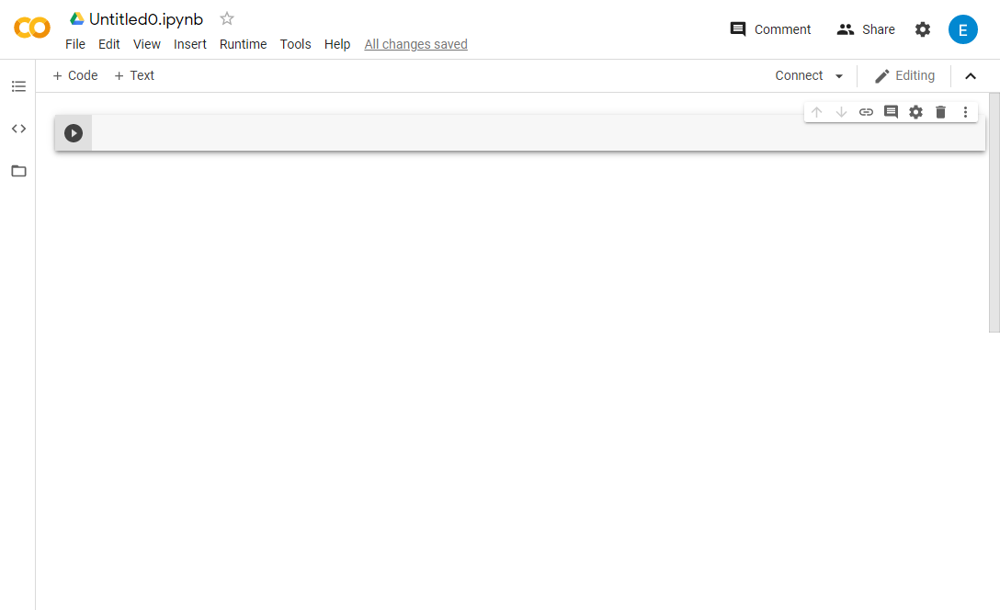

# Exercise 1: Environment Setup for Python

In this exercise, you do the following:
+ [Environment Setup for Python on Mac OS](#macos)
+ [Environment Setup for Python on Windows](#windows)
+ [Environment Setup for Python on Google Colab](#colab)
 
## Environment Setup for Python on Mac OS<a name="macos"></a>
Python on a Macintosh running Mac OS X (High Sierra) is in principle very similar to Python on any other Unix platform, but there are a number of additional features such as the IDE and the Package Manager that are worth pointing out.

Mac OS X 10.8 comes with Python 2.7 pre-installed by Apple. If you wish, you are invited to install the most recent version of Python 3 from the [Python website](https://www.python.org/downloads/mac-osx/). A current “universal binary” build of Python, which runs natively on the Mac’s new Intel and legacy PPC CPU’s, is available there.

1. Go to [Python website](https://www.python.org/downloads/mac-osx/).
1. Choose the latest Python release (e.g. Latest Python 3 Release - Python 3.8.3) and click Download [macOS 64-bit installer](https://www.python.org/ftp/python/3.8.3/python-3.8.3-macosx10.9.pkg).
1. Execute the installer.  


1. Installation completed. Press Command + Space, type terminal.app to open the text-based terminal.
1. Type ```python --version``` to see the installed version of Python on your Mac OS.


## Environment Setup for Python on Windows<a name="windows"></a>
Unlike most Unix systems and services, Windows does not include a system supported installation of Python.

Python release only supports a Windows platform while Microsoft considers the platform under extended support. This means that Python 3.8 supports Windows Vista and newer. If you require Windows XP support then please install Python 3.4.

1. Go to [Python website](https://www.python.org/downloads/windows/).
1. Choose the latest Python release (e.g. Latest Python 3 Release - Python 3.8.3), click Download [Windows x86-64 executable installer](https://www.python.org/ftp/python/3.8.3/python-3.8.3-amd64.exe) for 64-bit Windows, or [Windows x86 executable installer](https://www.python.org/ftp/python/3.8.3/python-3.8.3.exe) for 32-bit Windows.
1. Execute the installer.
1. Choose Add Python 3.8 to PATH and click Install Now.  

1. Customize installation will provide some options for installation.  


1. Installation completed.  


1. Go to Command Prompt, Type ```python --version``` to see the installed version of Python on your Windows OS.


## Environment Setup for Python on Google Colab<a name="colab"></a>
Colaboratory, or “Colab” for short, is a product from Google Research. Colab allows anybody to write and execute arbitrary python code through the browser, and is especially well suited to machine learning, data analysis and education. More technically, Colab is a hosted Jupyter notebook service that requires no setup to use, while providing free access to computing resources including GPUs.  


The Python development team has declared that Python 2 will no longer be supported after January 1st, 2020. As of that date, Colab has stopped updating Python 2 runtimes, and will begin phasing out support for Python 2 in the following months.

1. Go to [Google Colab](https://colab.research.google.com).
1. Sign in with your google account to start using Google Colab by clicking button on top right hand corner.
1. After sign in, [Welcome To Colaboratory](https://colab.research.google.com/notebooks/intro.ipynb) page shown.
1. Click File > New notebook on the top menu.  

1. New tab of new notebook pop up.  

1. Rename notebook by means of clicking the file name.  

1. Click Edit > Notebook settings or Runtime > Change runtime type on the top menu. 

1. Select GPU or TPU as Hardware accelerator.  

1. Click the right arrow of Connect > Connect to hosted runtime.

1. After connected, you can start using Google Colab. Mouseover to view the machine configuration.

1. Type ```print('Hello World')``` in the cell and press Cntl + Enter to compute.

